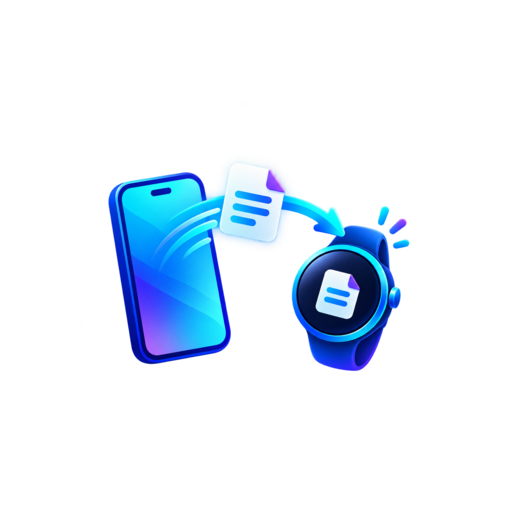

<p align="center">
  
</p>

<h1 align="center">WearDrop</h1>

<p align="center">Передача файлов между Android-смартфоном и Wear OS через Bluetooth — без облака и стороннего сервера.</p>

<p align="center">
  <a href="../../actions/workflows/build-apk.yml"></a>
  <a href="../../releases/latest"></a>
  
</p>

## Возможности

- передача телефон → часы и часы → телефон;
- один APK для Android и Wear OS;
- отправка одного или нескольких файлов через системное меню «Поделиться»;
- встроенный файловый менеджер с выбором до 200 файлов — работает без системного DocumentsUI;
- уведомления «Передаётся / Скачивается» с процентами, прошедшим и оставшимся временем;
- отдельное уведомление об успешном завершении или ошибке;
- потоковая передача через Bluetooth RFCOMM без загрузки файла целиком в память;
- Material 3 / Wear Material 3 с системной светлой или тёмной темой и динамическими цветами;
- автоматическое размещение медиафайлов в стандартных каталогах Android.

## Установка

Скачайте APK со страницы [Releases](../../releases/latest) и установите его на телефон и часы. Устройства должны быть предварительно сопряжены по Bluetooth. После первого запуска разрешите доступ к «Устройствам поблизости» и уведомлениям.

```bash
adb install -r WearDrop-v1.3.0.apk
adb shell appops set com.daniil.watchdrop MANAGE_EXTERNAL_STORAGE allow
```

## Использование

1. Включите приём в WearDrop на обоих устройствах.
2. Нажмите «Выбрать файлы и отправить» либо используйте «Поделиться → WearDrop».
3. Во встроенном файловом менеджере отметьте один или несколько файлов.
4. Выберите сопряжённое устройство и следите за прогрессом в уведомлении.

Полученные изображения сохраняются в `Pictures/WearDrop`, видео — в `Movies/WearDrop`, аудио — в `Music/WearDrop`, остальные файлы — в `Download/WearDrop`.

## Сборка

Проект находится в каталоге `WatchDrop`. Требуются JDK 17 и Android SDK 37.

```bash
cd WatchDrop
./gradlew :app:assembleRelease
```

GitHub Actions автоматически собирает подписанный release APK без суффикса `debug`. Изменения по версиям перечислены в [CHANGELOG.md](CHANGELOG.md).

## Ограничения

WearDrop использует собственный RFCOMM-протокол, поэтому приложение должно быть установлено на обоих устройствах. Это не реализация системного Bluetooth OPP.

Для встроенного файлового менеджера требуется разрешение «Доступ ко всем файлам». На Wear OS его нужно выдать через ADB командой `adb shell appops set com.daniil.watchdrop MANAGE_EXTERNAL_STORAGE allow`; системный экран разрешения на часах может отсутствовать. Разрешение используется только для показа каталогов и чтения выбранных пользователем файлов.

## Лицензия

Исходный код предоставляется «как есть» для личного использования и доработки.
